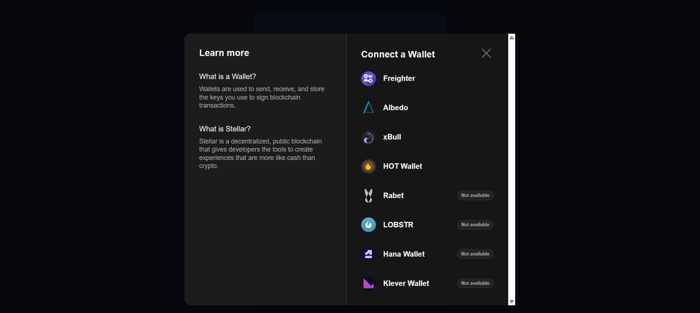
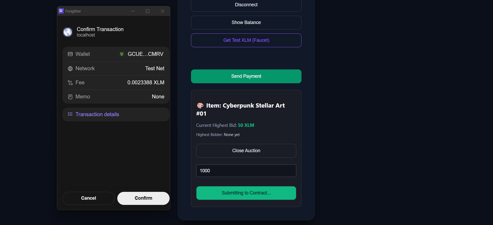
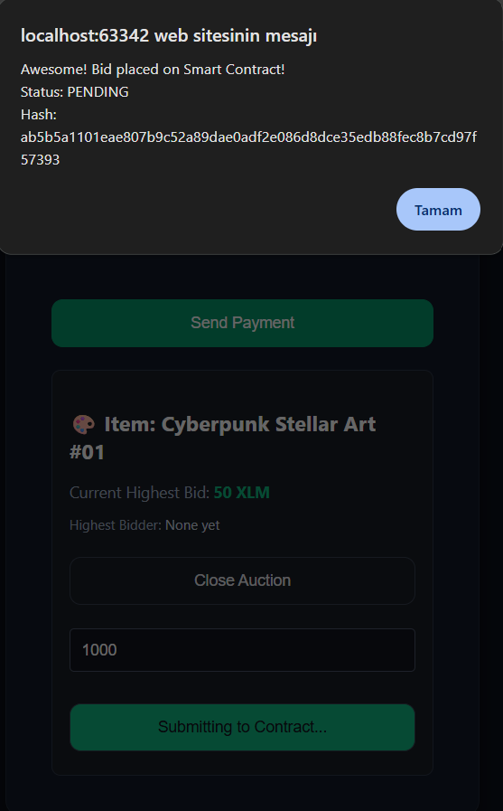

# Stellar Yellow Belt Challenge - Real-time Auction

A multi-wallet decentralized auction application built on the Stellar testnet using Soroban smart contracts. This project fulfills the requirements of the Stellar Yellow Belt Level 2 challenge.

## Setup Instructions
1. Clone this repository to your local machine.
2. Open the `index.html` file using a local web server (e.g., VS Code Live Server, IntelliJ built-in server, or Python http.server).
3. Connect your Stellar testnet wallet (Freighter, Albedo, etc.) using the "Connect Wallet" button.
4. Ensure you have Testnet XLM. You can use the built-in Faucet button if needed.
5. Enter a bid higher than the current highest bid and approve the transaction.

## Submission Checklist Requirements

* **Wallet Options Available:**
  *(Below is the screenshot showing the multi-wallet integration)*
  

* **Transaction Confirmation:**
  *(Signing the 1000 XLM bid transaction via Freighter)*
  

* **Successful Transaction & Hash:**
  *(Smart contract call success alert)*
  

* **Deployed Contract Address (Testnet):**
  `CCAZCDCJN4QJKX2WIX4P6VWSOPW7EXHELZTDGD4XLRRCBRHVDOCUFVUR`

* **Successful Transaction Hash (Verifiable on Stellar Explorer):**
  `ab5b5a1101eae807b9c52a89dae0adf2e086d8dce35edb88fec8b7cd97f57393`

## Features
* Multi-wallet support via Stellar Wallets Kit.
* Error handling for wallet connection, payments, and contract simulation.
* Real-time event publishing (`env.events().publish`) implemented in the Soroban smart contract.